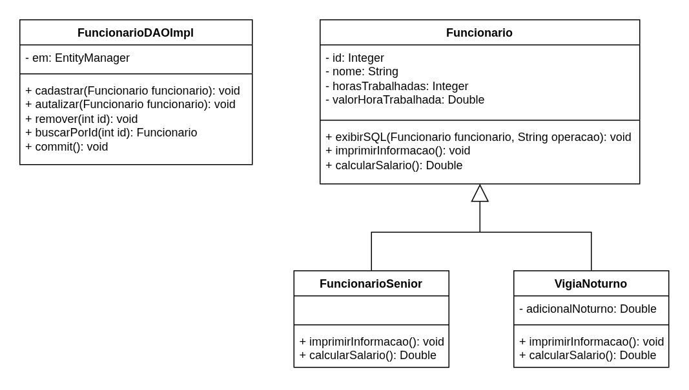
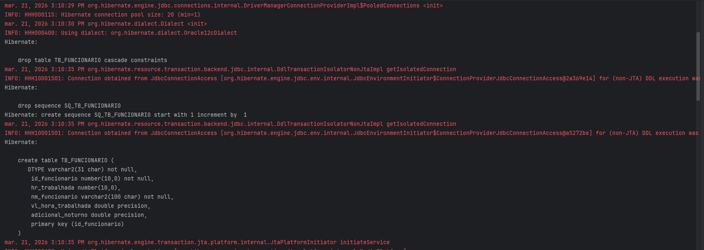
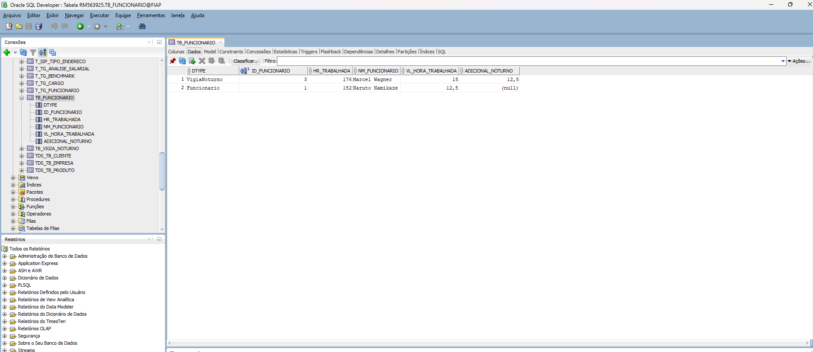
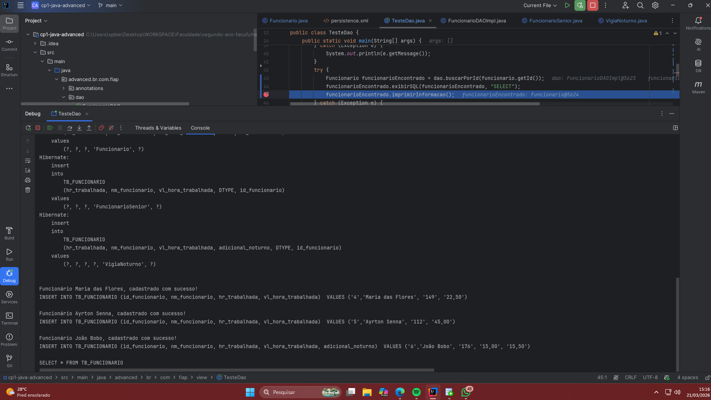
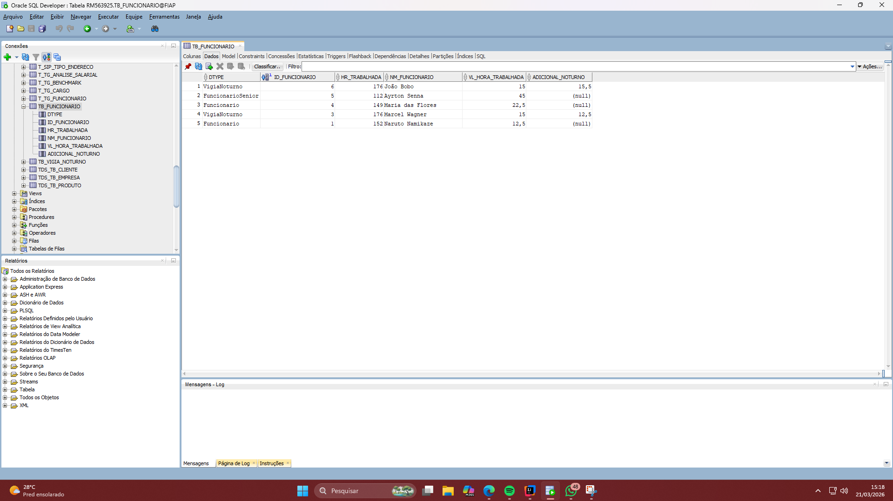
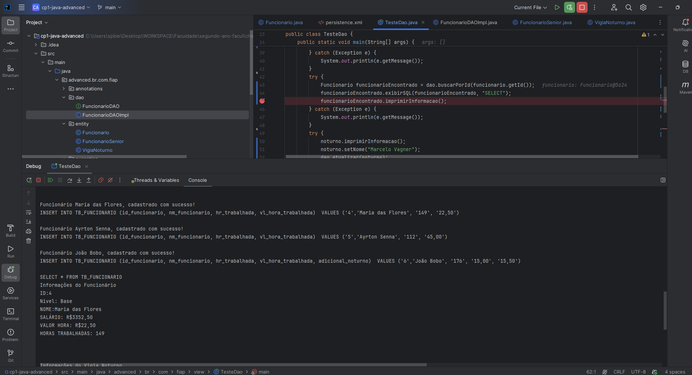
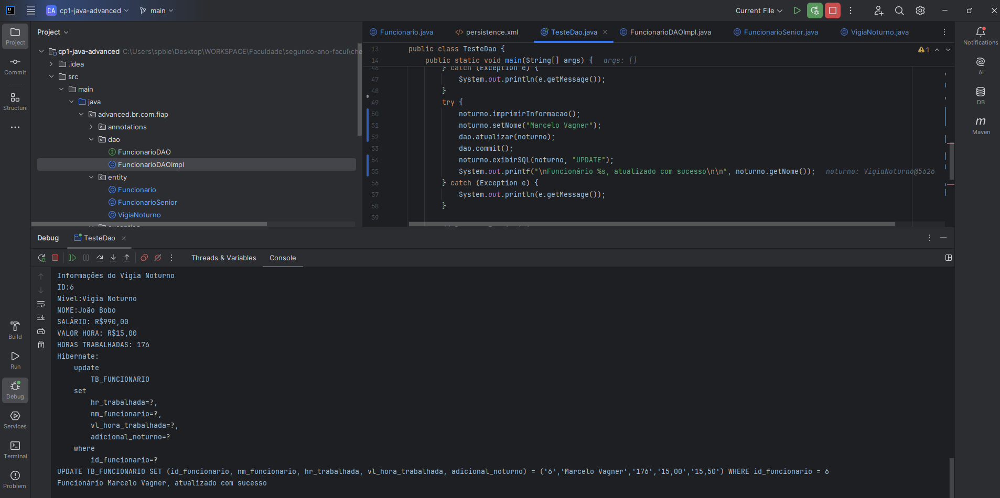
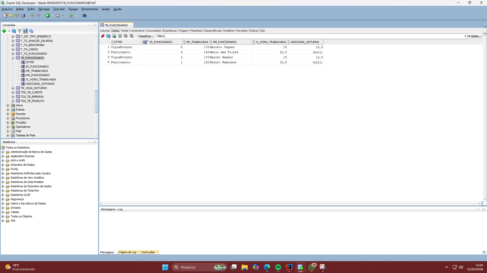
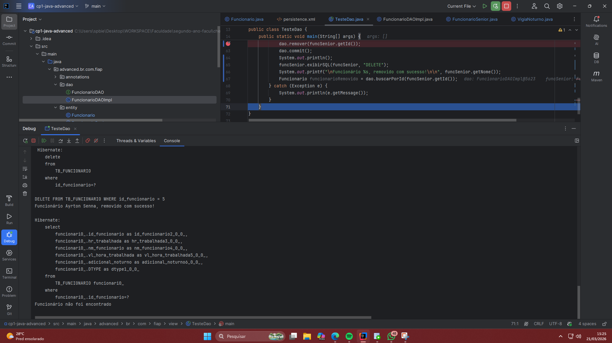

# CP01 - Java Advanced

_Programação em Java, JPA e Annotations_

Esta é uma aplicação para persistência de dados de Funcionários. Tem o objetivo de demonstrar os conhecimentos de 
persistência de dados no banco de dados Oracle, usando JPA / Hibernate.


## 📂 Estrutura de pastas

---

```
teste-cp1
├── src/main
│   ├── java/advanced/br/com/fiap
│   │   ├── annotations  # Anotações customizadas para o projeto
│   │   ├── dao          # Interfaces e Implementações do padrão Data Access Object
│   │   ├── entity       # Classes de domínio que representam as tabelas do banco
│   │   ├── exception    # Exceções personalizadas (erros de commit, ID não encontrado)
│   │   └── view         # Classe principal (Main) para execução do sistema
│   └── resources/META-INF
│       └── persistence.xml # Configurações de persistência de dados (JPA)
├── pom.xml              # Gerenciador de dependências Maven
└── .gitignore           # Arquivos ignorados pelo controle de versão
```

<br>


## 🚀 Tecnologias Utilizadas

---
* **Java JDK:** 21 ou superior
* **Framework de Persistência:** JPA / Hibernate
* **Gerenciador de Dependências:** Maven
* **Banco de Dados:** Oracle Database
* **IDE recomendada:** IntelliJ IDEA

<br>


## 📂 Estrutura do Projeto

---

A organização dos pacotes segue as melhores práticas de separação de responsabilidades:

* `annotations`: Contém anotações customizadas para mapeamento ou lógica de negócio.
* `dao`: Interface e implementação.
* `entity`: Classes de modelo (_models_) mapeadas como entidades do banco de dados.
* `exception`: Classes para tratamento de erros específicos.
* `view`: Classe `Main` que contém o ponto de entrada da aplicação para testes.
* `resources/META-INF`: Arquivo `persistence.xml` com as configurações de conexão com banco.

<br>


## 🛠️ Como Executar

---

1. Clone o repositório:

```Bash
git clone https://github.com/GNogueirovski/cp1-java-advanced.git
```

2. Importe o projeto na sua IDE como um projeto Maven.

3. Atualize as dependências do Maven (`pom.xml`).

4. Execute a classe `Main.java` localizada no pacote `br.com.fiap.view`.

<br>


## ⚙️ Configuração do Banco de Dados

---

Para executar o projeto, certifique-se de configurar as credenciais do seu banco Oracle no arquivo:
`src/main/resources/META-INF/persistence.xml`

```xml
<properties>
    <property name="javax.persistence.jdbc.user" value="SeuLoginAqui"/>
    <property name="javax.persistence.jdbc.password" value="SuaSenhaAqui"/>
</properties>
```

<br>


## Diagrama de Classes

---

<br/>


## 🎓 Demonstração

---
Abaixo há os prints das telas do terminal e do banco de dados mostrando o resultado da execução do CRUD. <br>
Saída no terminal para criação do banco.

<br/>


Estado inicial do banco

<br/>

<br>


### Incerir informações no banco: INSERT

---

Saida no terminal após inserir as informações.

<br/>

Banco após inserção.

<br/>

<br>


### Selecionar: SELECT

---

Saída no terminal após selecionar um funcionário.

<br/>

<br>


### Atualizar informações: UPDATE

---

Atualizar o vigia noturno de ID_FUNCIONARIO 6 de `João Bobo` para `Marcelo Vagner`.

Terminal.

<br/>

Banco de Dados, pré-update.

<br/>

Banco de Dados, pós-update.

<br/>

<br>


### Deletar informações: DELETE

---

<br/>

<br>


## 👤 Desenvolvedores

---

<div align="center">
  <table>
    <tr>
      <td align="center">
        <a href="https://github.com/AugustoBJunior">
          <br />
          <sub><b>Augusto Bonomo Jr</b></sub>
        </a>
      </td>
      <td align="center">
        <a href="https://github.com/GNogueirovski">
          <br />
          <sub><b>Gabriel Peixoto</b></sub>
        </a>
      </td>
      <td align="center">
        <a href="https://github.com/Giovanna-Nerii">
          <br />
          <sub><b>Giovanna Neri</b></sub>
        </a>
      </td>
    <tr>
      <td align="center">
        <a href="https://github.com/Mariinoue">
          <br />
          <sub><b>Mariana Inoue</b></sub>
        </a>
      </td>
      <td align="center">
        <a href="https://github.com/NathanaelV">
          <br />
          <sub><b>Nathanael Vieira</b></sub>
        </a>
      </td>
    </tr>
  </table>
</div>
